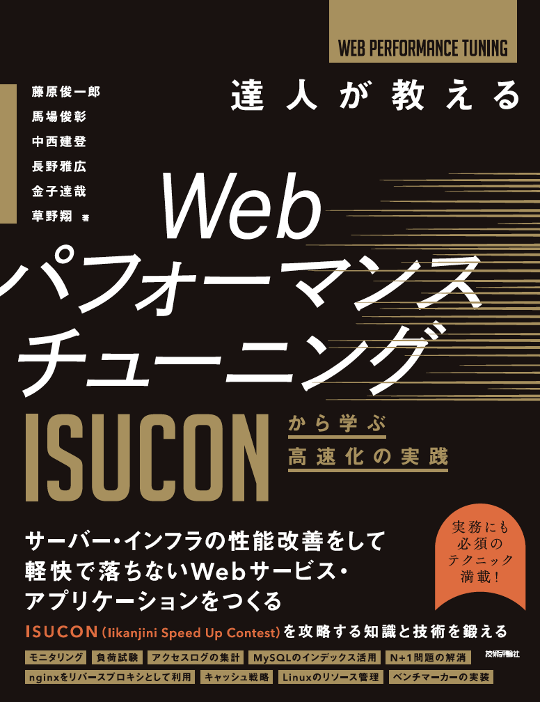

# 達人が教えるWebパフォーマンスチューニング〜ISUCONから学ぶ高速化の実践

このリポジトリは、[技術評論社「達人が教えるWebパフォーマンスチューニング〜ISUCONから学ぶ高速化の実践」](https://gihyo.jp/book/2022/978-4-297-12846-3) のサンプルコードを配布するものです。

## 書籍情報

書名：達人が教えるWebパフォーマンスチューニング〜ISUCONから学ぶ高速化の実践

著者：
- 藤原俊一郎 @fujiwara
- 馬場俊彰 @netmarkjp
- 中西建登 @whywaita
- 長野雅広 @kazeburo
- 金子達哉 @catatsuy
- 草野翔 @rosylilly

発売日：2022年6月4日

サイズ：B5変形判

ページ数：360ページ

価格：2,980円＋税

ISBN：978-4-297-12846-3

書籍購入リンク：https://gihyo.jp/book/2022/978-4-297-12846-3

## サンプルコード

### [Chapter2 モニタリング](chapter-2/README.md)

### [Chapter3 基礎的な負荷試験](chapter-3/README.md)

### [Chapter4 シナリオを持った負荷試験](chapter-4/README.md)

### [Chapter5 データベースのチューニング](chapter-5/README.md)

### [Chapter6 リバースプロキシの利用](chapter-6/README.md)

### [Chapter7 キャッシュの活用](chapter-7/README.md)

### [Chapter8 押さえておきたい高速化手法](chapter-8/README.md)

### [Chapter9 OSの基礎知識とチューニング](chapter-9/README.md)

### [付録A private-isuの攻略実践](appendix-A/README.md)

### [付録B ベンチマーカーの実装](appendix-B/example)

## 正誤表

[正誤表](errata.md)

## ライセンス

MIT
